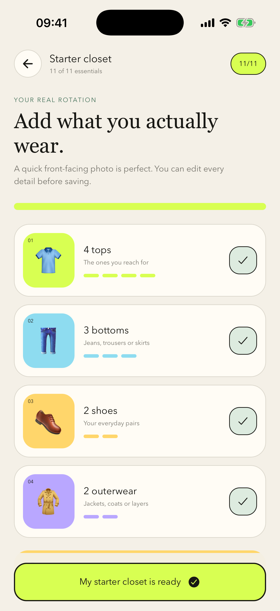
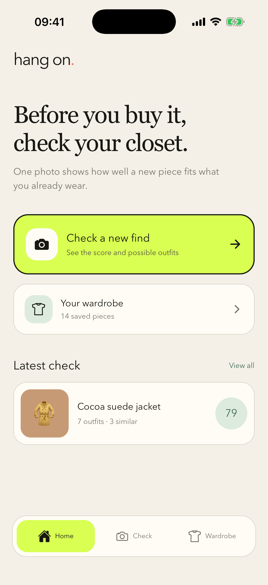
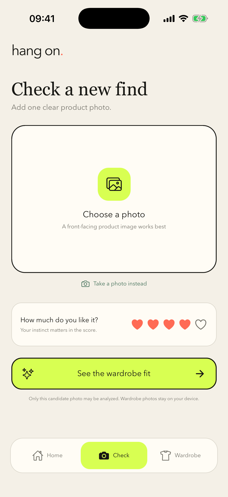
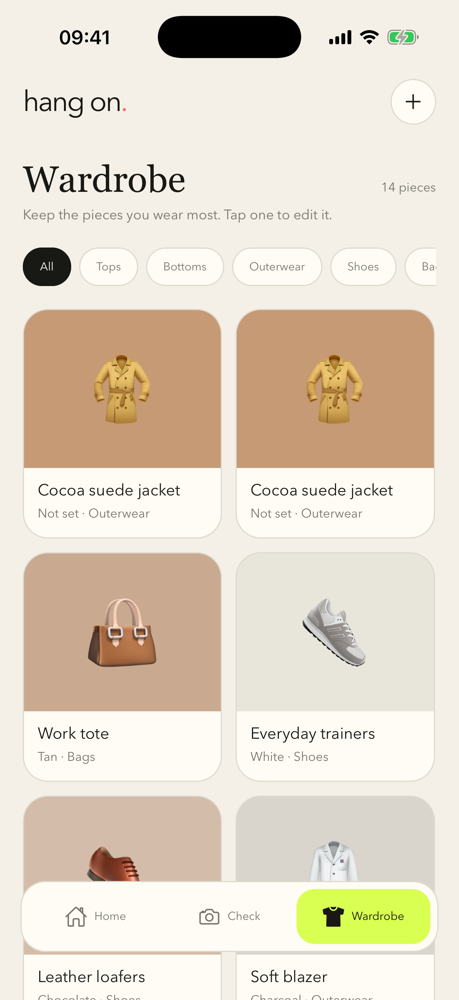
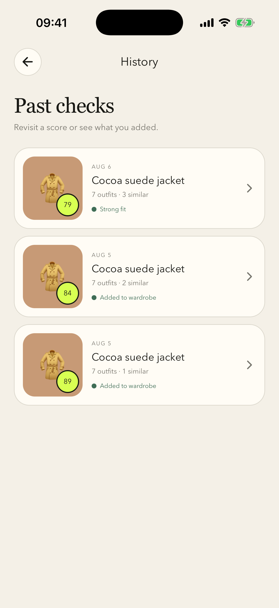
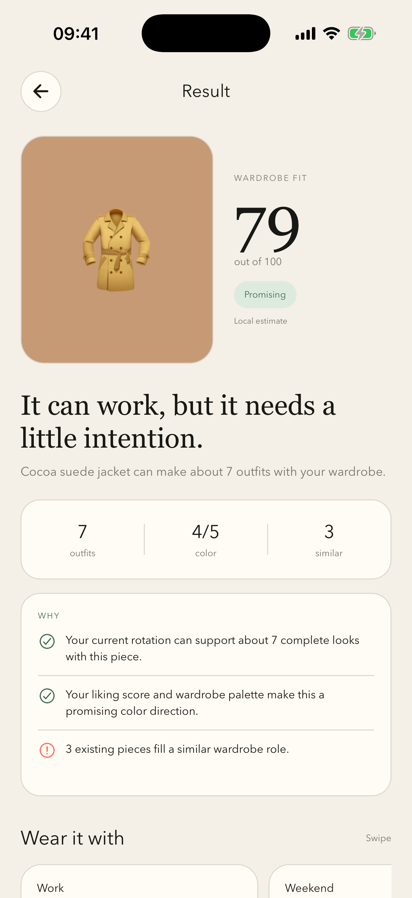

# Hang On

Hang On is a wardrobe-fit companion for the moment before a purchase. It helps someone see whether a new piece works with what they already own, how many outfits it unlocks, and whether an existing outfit can create the same feeling.

## Screenshots

| Onboarding | Home | Check a new find |
| --- | --- | --- |
|  |  |  |

| Wardrobe | History | Match result |
| --- | --- | --- |
|  |  |  |

## Working alpha

- Guided setup for 4 tops, 3 bottoms, 2 pairs of shoes, and 2 outerwear pieces
- Persistent on-device wardrobe and match-check history with SQLite
- Persistent private image storage in the app's document directory
- Wardrobe item create, edit, filter, and delete flows
- Camera and photo-library input for a new find
- Personal liking input before the match result
- Structured clothing-photo analysis through a server-side OpenAI Responses API call
- Explainable wardrobe-fit score with outfit, color, style, lifestyle, liking, and overlap signals
- Automatic private local estimate when photo analysis is not configured or unavailable
- Outfit collages and a “shop your closet” alternative using saved pieces
- One-tap add-to-wardrobe flow from a result

The vision model extracts clothing attributes; it never produces the final purchase score. Hang On calculates that score with deterministic rules so each result can show concrete reasons. Wardrobe photos remain on-device: the analysis request contains the candidate photo plus wardrobe metadata only.

Authentication, cloud sync, live weather, generated outfit imagery, and learned personalization remain later implementation layers.

## Run locally

Requirements: Node 24, Xcode 26.4 or newer, and an installed iOS Simulator runtime.

```bash
npm install
npm run ios
```

## Enable photo analysis

Create `.env.local` in the project root (it is ignored by Git):

```env
OPENAI_API_KEY=your_project_api_key
OPENAI_VISION_MODEL=gpt-5.6-terra
PORT=8787
EXPO_PUBLIC_ANALYSIS_API_URL=http://127.0.0.1:8787
```

Never put the API key in an `EXPO_PUBLIC_` variable. Run the backend and app in separate terminals:

```bash
npm run server
npm run ios
```

For a physical iPhone, replace `127.0.0.1` with the Mac's LAN address. Before production, deploy `server/` behind HTTPS with user authentication and rate limiting.

Useful checks:

```bash
npm run typecheck
npm run server:check
npm run server:test
npx expo-doctor
npx expo export --platform ios
```

## Structure

- `App.tsx` — local app orchestration, image-picker flows, and lightweight navigation
- `src/screens` — Home, Check, Result, History, onboarding, and Wardrobe screens
- `src/components` — shared brand header, tab bar, and clothing tiles
- `src/storage` — SQLite migrations, queries, and managed local images
- `src/services` — candidate-photo upload to the private analysis backend
- `src/domain` — explainable local and vision-backed result construction
- `server/src/vision.ts` — structured clothing-attribute extraction
- `server/src/scoring.ts` — deterministic wardrobe-fit scoring and reasons
- `src/data.ts` — optional example wardrobe data
- `src/theme.ts` — brand colors, typography, and shadows
